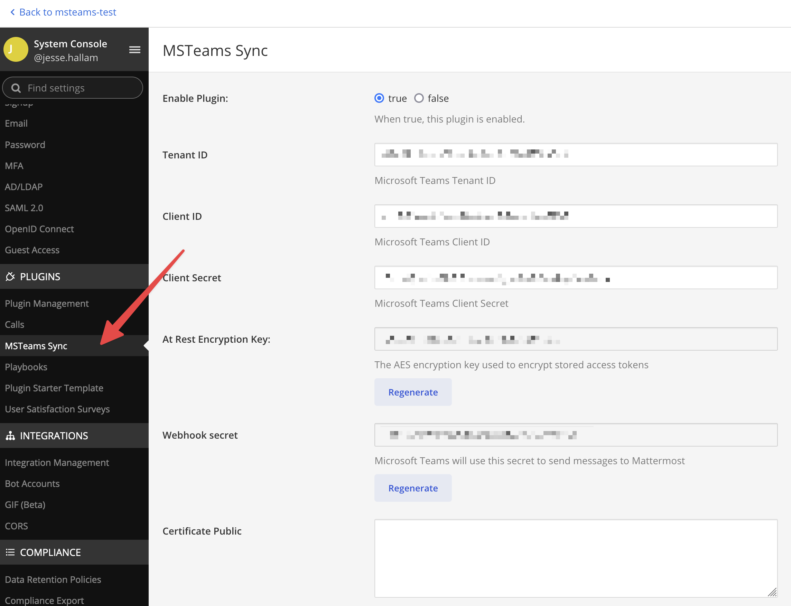

# Renewing an OAuth application in Azure

### Step 1: Create a new client secret

1. Sign into [portal.azure.com](https://portal.azure.com) using an admin Azure account.
2. Navigate to [App Registrations](https://portal.azure.com/#blade/Microsoft_AAD_IAM/ActiveDirectoryMenuBlade/RegisteredApps)
3. Click on the application you previously created.

4. Navigate to **Certificates & secrets** in the left pane.

5. Click on **New client secret**. Enter the description and click on **Add**. 

6. After the creation of the client secret, copy the new secret value, not the secret ID. We'll use this value later in the Mattermost admin console.

### Step 2: Configure the MS Teams Plugin

1. Go to the MS Teams plugin configuration page on Mattermost as System Console > Plugins > MSTeams Sync.

2. Update the **Client Secret**. DO NOT update the **Client ID**.

3. Save the plugin settings

### Step 3. Restart the MS Teams Plugin

1. Go to the **Plugin Management** page on Mattermost as System Console > Plugin Management.

2. Scroll to the **MS Teams Sync** plugin and click **Disable**

3. After the plugin has disabled, click **Enable**

