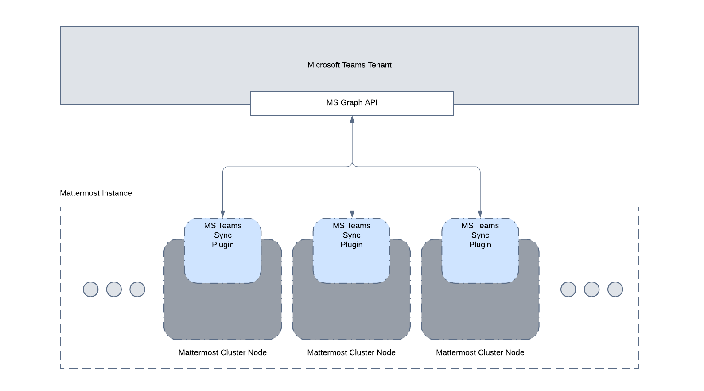

# FAQ
- [How is encryption handled at rest and in motion?](#how-is-encryption-handled-at-rest-and-in-motion)
- [Are there any database or network security considerations?](#are-there-any-database-or-network-security-considerations)
- [Are there any compliance considerations (ie. GDPR, PCI)?](#are-there-any-compliance-considerations-ie-gdpr-pci)
- [How often will users sync from MS Teams to Mattermost?](#how-often-will-users-sync-from-ms-teams-to-mattermost)
- [Is a service account required for this integration to sync users from MS Teams to Mattermost?](#is-a-service-account-required-for-this-integration-to-sync-users-from-ms-teams-to-mattermostmd#are-there-any-database-or-network-security-considerations)
- [How is the plugin architectured?](#how-is-the-plugin-architectured)

## How is encryption handled at rest and in motion?

Everything is stored in the Mattermost databases. AES encryption is used to encrypt the MS Teams auth/access token. Other encryption at rest would be dependent on how the Mattermost instance is setup. All communication between the plugin and MS Teams/Graph API are conducted over SSL/HTTPS.

## Are there any database or network security considerations?

There is nothing specific to the plugin that is beyond what would apply to the Mattermost instance.

## Are there any compliance considerations (ie. GDPR, PCI)?

There is nothing specific to the plugin that is beyond what would apply to the Mattermost instance.

## How often will users sync from MS Teams to Mattermost?

The frequency of user syncing is customizable within the plugin configuration page.

## Is a service account required for this integration to sync users from MS Teams to Mattermost?

No, user syncing is done by the "application" itself.

## How is the plugin architectured?

The architecture diagram is below:

